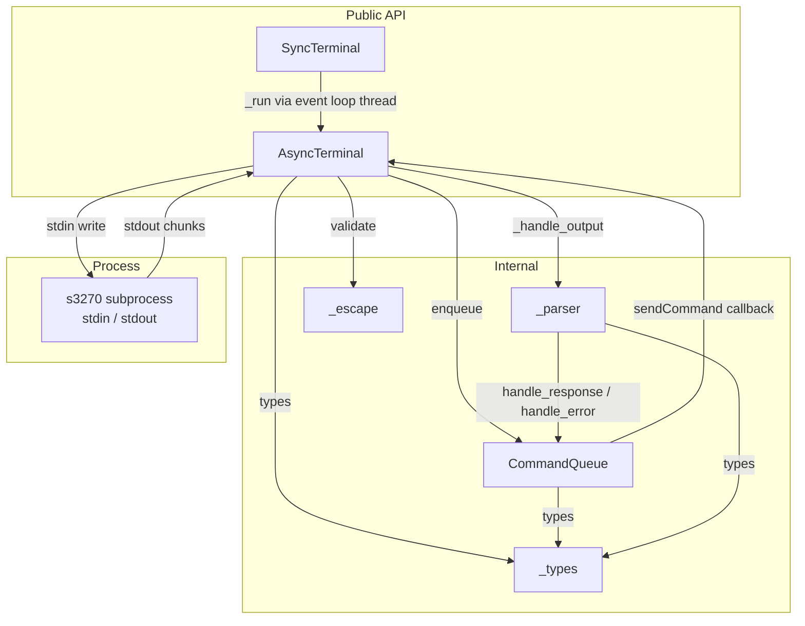

# TDD - py3270: Python s3270 Terminal Wrapper

| Field        | Value                                             |
|--------------|---------------------------------------------------|
| Tech Lead    | TBD                                               |
| Team         | TBD                                               |
| Epic/Ticket  | TBD                                               |
| Status       | Draft                                             |
| Created      | 2026-03-16                                        |
| Last Updated | 2026-03-16                                        |

---

## Context

`py3270` is a Python library that wraps the `s3270 -script` subprocess, providing programmatic control over IBM 3270 terminal emulation. The library targets automation, testing, and integration scenarios where applications need to interact with mainframe systems via a 3270 terminal session.

**Background**: A TypeScript reference implementation already exists and is fully documented in `docs/S3270_WRAPPER_FULL_DOCUMENTATION.md`. That document represents the complete behavioral contract for this port. The present work is not a redesign—it is a faithful reimplementation in Python, with a small number of intentional improvements (async-first concurrency, typed dataclasses, stdlib-only runtime dependencies).

**Domain**: Mainframe terminal automation. The `s3270` binary (from the open-source `x3270` suite) implements TN3270 connectivity and exposes a script-mode stdin/stdout protocol (see [s3270 Manual Page](s3270_Manual_Page.mD) for the full options reference, supported actions, and character sets). `py3270` encapsulates all protocol detail and exposes a clean Python API.

**Stakeholders**: Python developers writing mainframe automation scripts, testers automating legacy system flows, and infrastructure teams integrating mainframe access into CI pipelines.

---

## Problem Statement & Motivation

### Problems We're Solving

- **No idiomatic Python library for s3270 scripting**: Existing Python options are unmaintained or do not expose the full s3270 scripting protocol. Developers end up writing ad-hoc subprocess wrappers that duplicate framing, parsing, and error handling logic.
  - Impact: Duplicated fragile code across projects; protocol bugs are hard to diagnose.

- **No type-safe API surface**: Without typed dataclasses and enums, callers receive raw strings and must re-parse status data themselves.
  - Impact: Integration scripts are error-prone and hard to maintain.

- **Single-threaded blocking approaches break async applications**: Most ad-hoc wrappers are synchronous and thread-unsafe.
  - Impact: Cannot integrate cleanly into modern Python async services.

### Why Now?

- The TypeScript implementation has reached behavioral stability and its specification is fully documented, making a faithful port feasible with low ambiguity.
- Python 3.13 provides `StrEnum`, improved `asyncio` primitives, and `dataclasses` with `slots=True`, enabling a clean, performant implementation.

### Impact of NOT Solving

- **Technical**: Teams continue writing one-off subprocess wrappers with inconsistent timeout, error, and cleanup behavior.
- **Maintainability**: No shared, tested library to reference; bugs are duplicated across codebases.

---

## Scope

### ✅ In Scope (V1 - MVP)

- Python 3.13+ package `py3270` with `src/` layout
- `AsyncTerminal` class — async-first interface over `s3270 -script` subprocess
- `SyncTerminal` class — synchronous proxy backed by a background event loop thread
- Full parity with the TypeScript behavioral contract (see `S3270_WRAPPER_FULL_DOCUMENTATION.md`)
- All public methods: lifecycle, connect/disconnect, wait helpers, screen operations, text/input helpers, query/status, read/write, key actions, status-derived getters
- Typed enums (`StrEnum`) for `TerminalMode`, `TerminalSetting`, `StatusFlag`, `KeyboardState`, `ScreenFormatting`, `FieldProtection`, `ConnectionState`, `EmulatorMode`
- Frozen dataclasses for `TerminalResponse`, `StatusInfo`, `ScreenPosition`, `ScreenSize`, `FieldDefinition`
- Response parser with chunked-stdout accumulation
- Status line parser for all 12 fields
- Escape sequence validation ported from Appendix B of the specification
- Async command queue: one in-flight command, per-command timeout, clean rejection on stop/exit
- Retry-on-timeout support via `TerminalOptions.max_retries` and `retry_delay_ms`
- stdlib-only runtime dependencies
- Test suite: pytest + pytest-asyncio + pytest-mock
- `pyproject.toml` packaging metadata
- `README.md` with usage examples

### ❌ Out of Scope (V1)

- CLI entrypoint / shell command
- Connection pooling or multi-session management
- GUI or TUI interface
- Plugin architecture
- Support for `ws3270` or `x3270` variants
- Python < 3.13

### 🔮 Future Considerations (V2+)

- Context manager shortcuts that auto-start on `async with`
- Connection pooling for high-throughput automation
- Structured logging integration hooks
- Wheel distribution to PyPI

---

## Technical Solution

### Architecture Overview

The library has two runtime layers and four foundational support modules:

| Layer              | Module              | Responsibility                                               |
|--------------------|---------------------|--------------------------------------------------------------|
| Public API         | `_terminal.py`      | `AsyncTerminal`: subprocess lifecycle, high-level methods    |
| Public API         | `_sync.py`          | `SyncTerminal`: synchronous proxy over `AsyncTerminal`       |
| Serialization      | `_queue.py`         | `CommandQueue`: one-in-flight, timeout, stop/drain           |
| Protocol           | `_parser.py`        | Response and status line parsing                             |
| Validation         | `_escape.py`        | Escape sequence validation                                   |
| Types              | `_types.py`         | Enums, dataclasses, type aliases                             |

**Architecture Diagram**:



### Data Flow

1. **Caller invokes method** (e.g., `await terminal.connect("host", 23)`)
2. **`AsyncTerminal`** builds the s3270 command string and calls `command_queue.enqueue(cmd, timeout)`
3. **`CommandQueue`** places the command on the internal queue; the worker task dequeues it and invokes the `send_fn` callback
4. **`send_fn`** writes `cmd\n` to `s3270` stdin
5. **`s3270`** processes the command and writes response lines to stdout
6. **Reader task** (`_reader_task`) reads stdout chunks, passes to `_handle_output`
7. **`_handle_output`** accumulates a buffer, detects terminal lines (`ok` / `error…`), and calls `_process_response(lines)`
8. **`_process_response`** parses the response via `_parser`, updates `_screen_buffer` and `_last_status_line`, then resolves or rejects the `CommandQueue` future
9. **`CommandQueue.enqueue`** returns the resolved `TerminalResponse` to the caller

**Sync path**: `SyncTerminal._run(coro)` submits the coroutine to the background event loop and blocks until the result is available.

### Module Contracts

#### `_types.py`

Defines all shared data types with no external dependencies.

- **Enums** (all `StrEnum`, snake_case values): `TerminalMode`, `TerminalSetting`, `StatusFlag`, `KeyboardState`, `ScreenFormatting`, `FieldProtection`, `ConnectionState`, `EmulatorMode`
  - `TerminalMode` values (`P`, `S`, `N`, `L`, `B`) correspond to the connection-string prefix characters documented in the [s3270 Manual Page](s3270_Manual_Page.mD) Description section
- **Dataclasses** (`slots=True, frozen=True`): `TerminalResponse`, `ScreenPosition`, `ScreenSize`, `StatusInfo`, `FieldDefinition`
- **`TerminalOptions`** (mutable dataclass with defaults):
  - `executable: str = "s3270"`
  - `args: list[str] = []`
  - `timeout: int = 30_000` (ms)
  - `max_retries: int = 0`
  - `retry_delay_ms: int = 500`
- **Type alias**: `FieldDefinitionRecord = dict[str, str | int | float | None]`

#### `_parser.py`

Stateless functions with no subprocess dependencies.

- `parse_response(lines: list[str]) -> TerminalResponse`
  - Last line determines `ok` (bool)
  - Penultimate line is `status`
  - All preceding lines are joined as `data`
- `parse_status(line: str) -> StatusInfo | None`
  - Splits on whitespace; requires ≥ 12 fields
  - Field 4 pattern `C(host)` extracts `connection_host`
  - Field 12: `-` maps to `None`, otherwise parsed as float seconds

#### `_escape.py`

- `validate_escape_sequences(s: str) -> None`
  - Direct port of TypeScript Appendix B logic
  - Raises `ValueError` with position and offending sequence on any invalid escape
  - Allowed sequences: `\b`, `\eXX-XXXX`, `\f`, `\n`, `\paN`, `\pfNN`, `\r`, `\t`, `\T`, `\uXX-XXXXX`, `\xXX-XXXXX`, `\\`, `\"`
  - The full set of escape sequences and their meanings is defined in the [s3270 Manual Page](s3270_Manual_Page.mD) under "The String Action" section

#### `_queue.py` — `CommandQueue`

Internal serialization layer; never used directly by callers.

- `_TerminalCommand` dataclass: `command: str`, `future: asyncio.Future[TerminalResponse]`, `timeout: float`
- Background `_worker_task`: dequeues one command, awaits `asyncio.wait_for(future, timeout)`, on `TimeoutError` sets exception on future, continues to next
- `enqueue(cmd, timeout) -> TerminalResponse`: creates Future, puts on queue, awaits Future (caller suspends here)
- `handle_response(resp)` / `handle_error(err)`: called by stdout reader; resolves/rejects current future
- `stop()`: rejects active command with `"Queue stopped"`, drains queue with `"Process terminated"`

#### `_terminal.py` — `AsyncTerminal`

Core public class.

- **Lifecycle**: `start()` (idempotent), `stop()` (kills process, drains queue)
- **Process management**: `asyncio.create_subprocess_exec` with `PIPE` on stdin/stdout/stderr
- **Reader task**: reads stdout chunks in a background task; feeds `_handle_output`
- **Stderr**: routed to `logging.getLogger("py3270.stderr")` at `DEBUG` level
- **Retry loop in `command()`**: retries up to `max_retries` times on `asyncio.TimeoutError` with `retry_delay_ms` backoff
- **All public methods are `async def`**
- **`__aenter__`** returns `self` (no auto-start); **`__aexit__`** calls `stop()`

#### `_sync.py` — `SyncTerminal`

Thin synchronous proxy.

- Constructor spawns a daemon thread running `asyncio.new_event_loop().run_forever()`
- `_run(coro)`: `asyncio.run_coroutine_threadsafe(coro, self._loop).result()`
- Every `AsyncTerminal` public method proxied via `_run(...)`
- `__enter__` / `__exit__`: exit calls `stop()`, then stops and joins the event loop thread

### Public API Summary

| Method | Description |
|---|---|
| `start()` | Spawn `s3270`, attach I/O tasks. Idempotent. |
| `stop()` | Kill process, drain queue. |
| `command(cmd, timeout?)` | Execute raw s3270 command. Raises if not started. |
| `connect(host, port, mode?, lu?)` | Auto-starts; builds connection string; sets `connected`. Connection string syntax follows the `[prefix:]...[LUname@]hostname[:port]` form documented in the [s3270 Manual Page](s3270_Manual_Page.mD). |
| `disconnect()` | Disconnects (or synthetic success if not connected), then stops. |
| `wait(ms)` | Sleep clamped to [0, 300_000]. |
| `wait_output(timeout?)` | `Wait(<t>, Output)` command. |
| `wait_unlock(timeout?)` | `Wait(<t>, Unlock)` command. |
| `wait_ready(timeout?)` | `wait_output` then `wait_unlock`. |
| `wait_for(text, row?, col?, timeout?)` | Polls screen until text found. Requires row+col together or neither. |
| `screen(refresh?)` | Returns screen as newline-joined string. |
| `refresh()` | Executes `ascii`, updates `_screen_buffer`. |
| `get_screen_buffer()` | Returns copy of `_screen_buffer`. |
| `string(s)` | Validates and sends `string(<s>)`. Escape sequences are those accepted by s3270's `String` action — see the [s3270 Manual Page](s3270_Manual_Page.mD) under "The String Action". |
| `move(row, col)` | `movecursor(row,col)`. |
| `enter()` | `enter` + `wait_ready`; returns `self`. |
| `tab(count?)` | `tab` × count + `wait_ready`; returns `self`. |
| `pf(n)` | `pf(n)` (1–24) + `wait_ready`; returns `self`. |
| `pa(n)` | `pa(n)` (1–3) + `wait_ready`; returns `self`. |
| `clear()` | `clear` + `wait_ready`; returns `self`. |
| `query(what)` | `query(<what>)`. |
| `get(setting)` | `query(setting)`, returns trimmed text. |
| `is_(flag)` | `query(flag)`, returns bool. |
| `cursor()` | `query('Cursor')`, returns `ScreenPosition`. |
| `screen_size()` | `query('ScreenSize')`, returns `ScreenSize`. |
| `current_field()` | `query('CurrentField')`, returns `{start, length}` or `None`. |
| `available()` | `query('query')`, returns list of lines. |
| `read(row, col, length, trim?)` | Read from `_screen_buffer` (1-based). |
| `write(text, row, col, length?)` | Move cursor, optional pad/truncate, send `string`. |
| `read_many(fields)` | Batch read using `FieldDefinition` map. |
| `check(row, col, text)` | `read` exact span, strict equality. |

### Package Layout

```
py3270/
├── pyproject.toml
├── README.md
├── src/
│   └── py3270/
│       ├── __init__.py        # Public re-exports
│       ├── _types.py          # Enums + dataclasses
│       ├── _parser.py         # Response + status parsing
│       ├── _escape.py         # Escape sequence validation
│       ├── _queue.py          # Async command queue
│       ├── _terminal.py       # AsyncTerminal
│       └── _sync.py           # SyncTerminal
└── tests/
    ├── conftest.py            # Shared mock-subprocess fixtures
    ├── test_parser.py
    ├── test_escape.py
    ├── test_queue.py
    ├── test_terminal.py
    └── test_sync.py
```

---

## Risks

| Risk | Impact | Probability | Mitigation |
|------|--------|-------------|------------|
| Chunked stdout splits a response across reads, causing misparse | High | High | Buffer accumulation loop in `_handle_output`; parser tests with split chunks cover this path |
| `asyncio.wait_for` timeout semantics differ from Node.js per-command timeout behavior | High | Medium | Shield the command future separately from the timeout; unit test timeout fires and reject semantics explicitly |
| Cross-platform subprocess differences (`s3270` stdin/stdout behavior on Windows vs. Unix) | Medium | Medium | Use `asyncio.create_subprocess_exec` with explicit `PIPE`; CI matrix includes Linux and Windows |
| `CommandQueue` re-entrancy: `handle_response` called with no active command | Low | Medium | Guard with explicit null-check and `logging.warning`; covered in queue unit tests |
| `SyncTerminal` event loop thread not cleaned up on abnormal exit | Medium | Low | Daemon thread (auto-killed on main process exit); `__exit__` calls `loop.call_soon_threadsafe(loop.stop)` + `thread.join()` |
| Escape sequence regex port diverges from TypeScript reference | High | Low | Unit tests replicate every acceptance/rejection case from Appendix B |
| `s3270` binary not found on target system | High | Low | Raise `FileNotFoundError` with actionable message pointing to x3270 distribution |

---

## Implementation Plan

| Phase | Task | Description | Status | Estimate |
|---|---|---|---|---|
| **Phase 1 — Foundation** | `_types.py` | All enums and dataclasses | TODO | 0.5d |
| | `_parser.py` | `parse_response` + `parse_status` | TODO | 0.5d |
| | `_escape.py` | `validate_escape_sequences` | TODO | 0.5d |
| | `pyproject.toml` | Build metadata, dev extras | TODO | 0.25d |
| | `tests/conftest.py` | Mock subprocess fixtures | TODO | 0.5d |
| **Phase 2 — Async Core** | `_queue.py` | `CommandQueue` with worker task | TODO | 1d |
| | `_terminal.py` | `AsyncTerminal` full implementation | TODO | 3d |
| **Phase 3 — Sync Wrapper** | `_sync.py` | `SyncTerminal` proxy + thread | TODO | 0.5d |
| **Phase 4 — Tests** | `test_parser.py` | Parser + status line unit tests | TODO | 0.5d |
| | `test_escape.py` | Escape validation acceptance/rejection | TODO | 0.5d |
| | `test_queue.py` | Queue ordering, timeout, stop/drain | TODO | 1d |
| | `test_terminal.py` | Full `AsyncTerminal` behavior | TODO | 2d |
| | `test_sync.py` | Sync proxy smoke tests | TODO | 0.5d |
| **Phase 5 — Documentation** | `README.md` | Async + sync usage examples | TODO | 0.5d |
| | `__init__.py` | Finalize public re-exports | TODO | 0.25d |

**Total Estimate**: ~12 days

**Sequencing constraints**:
- Phase 1 must complete before Phase 2
- Phase 2 (`_queue.py`) must complete before `_terminal.py`
- Phase 2 must complete before Phase 3
- Phase 4 runs in parallel once Phase 3 is complete

---

## Testing Strategy

| Test Type | Scope | Coverage Target | Tooling |
|---|---|---|---|
| Unit | `_parser`, `_escape`, `_queue`, `_types` | 100% line coverage | pytest |
| Integration | `AsyncTerminal` full method surface | All public methods | pytest-asyncio + pytest-mock |
| Integration | `SyncTerminal` proxy | Context manager + key methods | pytest |
| Edge-case | Chunked stdout, process exit during command | Protocol invariants | pytest-asyncio |

### Test Scenarios by Module

**`test_parser.py`**:
- `parse_response`: zero data lines + `ok`; multiple data lines + `ok`; `error...` terminal line; chunked accumulation split across newline boundary
- `parse_status`: valid 12-field line; fewer than 12 fields returns `None`; `C(host)` extracts `connection_host`; `-` execution time maps to `None`; numeric fields parsed correctly

**`test_escape.py`**:
- Every valid single-char and multi-char escape sequence passes
- Invalid escapes (`\q`, `\pa4`, `\pf0`, `\pf25`, truncated `\e`) raise `ValueError`
- Mixed valid and invalid in same string raises on first invalid

**`test_queue.py`**:
- Commands resolved in FIFO order
- Timeout fires → command rejected with `"Command timeout: <cmd>"`
- `stop()` rejects active command with `"Queue stopped"`
- `stop()` drains pending commands with `"Process terminated"`
- Late `handle_response` after `stop()` is a no-op (no exception)

**`test_terminal.py`**:
- `start()` idempotency (second call does not spawn second process)
- `stop()` idempotency
- `command()` before `start()` raises
- `connect()` builds correct string variants: plain, with mode, with LU name, with both; host is lowercased
- `disconnect()` when not connected returns synthetic success and calls `stop()`
- `wait_for()` raises on row without col (and vice versa)
- `pf(0)` and `pf(25)` raise; `pa(0)` and `pa(4)` raise
- `read()` 1-based coordinate math; row out of bounds returns `""`
- `write()` truncates to `length`; right-pads with spaces when input is shorter
- Process exit resets `connected` and drains queue

**`test_sync.py`**:
- Context manager (`with SyncTerminal() as t`) starts and stops cleanly
- Synchronous `connect` / `disconnect` proxy executes without deadlock
- Thread is cleaned up after `__exit__`

---

## Alternatives Considered

| Alternative | Reason Rejected |
|---|---|
| **Synchronous-only implementation using `threading.Lock`** | Cannot integrate into async applications without blocking the event loop; async-first is strictly more general |
| **`subprocess.Popen` with `select`/poll loop** | Platform-inconsistent on Windows; `asyncio` subprocess provides a uniform cross-platform API |
| **Reuse existing `py3270` package on PyPI** | Last meaningful release was 2016; does not expose the full s3270 script protocol; no type annotations |
| **gRPC or socket-based protocol** | `s3270 -script` uses stdin/stdout; introducing another transport adds unnecessary complexity |
| **`verbose: bool` flag for debug output** | Replaced by stdlib `logging`; callers can set log level without any library changes; simpler API surface |

---

## Open Questions

| # | Question | Owner | Status |
|---|---|---|---|
| 1 | Should `AsyncTerminal.__aenter__` auto-call `start()` for ergonomics? | TBD | Open |
| 2 | Should `wait` timeout clamping emit a `logging.warning` when the value is out of range? | TBD | Open |
| 3 | Should `read_many` support async field reads in parallel, or always sequential? | TBD | Open |
| 4 | What is the target CI matrix (OS × Python version)? | TBD | Open |
| 5 | Should `pyproject.toml` include type stubs (`py.typed` marker) for downstream type checking? | TBD | Open |
