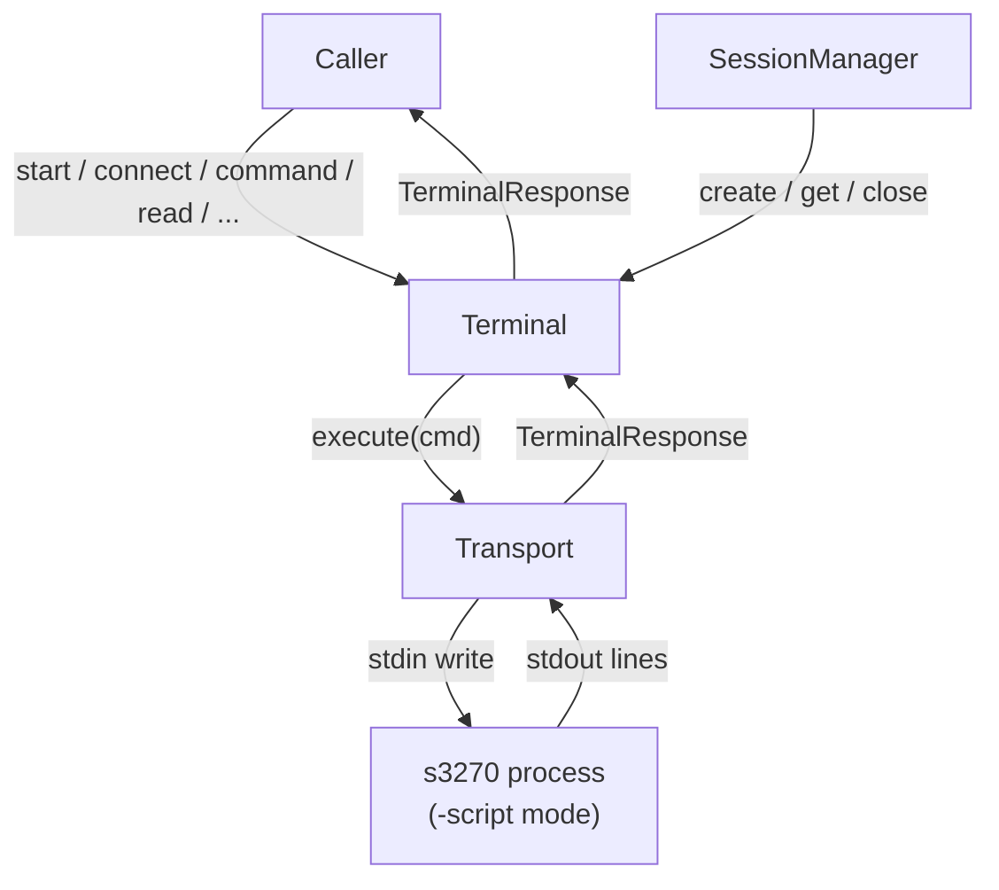

# TDD -- py3270: Python s3270 Terminal Wrapper

Field         | Value
------------- | ----------
Tech Lead     | TBD
Team          | TBD
Epic / Ticket | TBD
Status        | Draft
Created       | 2026-03-16
Last Updated  | 2026-03-16

--------------------------------------------------------------------------------

## Context

**s3270** is a headless IBM 3270 terminal emulator that exposes a scriptable stdin/stdout interface (`-script` mode). It implements RFCs 2355 (TN3270E), 1576 (TN3270), and 1646 (LU name selection), allowing automated control of IBM mainframe sessions from an external process.

A TypeScript/Node.js wrapper library already exists that encapsulates the full s3270 protocol: process lifecycle, a serialized command queue, response framing, screen operations, status parsing, and a rich high-level API. That implementation is documented exhaustively in `S3270_WRAPPER_FULL_DOCUMENTATION.md`.

There is currently no Python equivalent. The Python ecosystem is widely used for automation, RPA, and enterprise data-extraction workloads that target IBM mainframe environments. A native Python library with full behavioral parity to the TypeScript version is necessary to serve those use cases.

**Domain**: Mainframe automation / terminal emulation.

**Stakeholders**: Python developers building mainframe automation scripts; teams migrating from REXX/JCL or legacy screen-scraping tools; QA automation engineers.

--------------------------------------------------------------------------------

## Problem Statement & Motivation

### Problems We're Solving

- **No native Python wrapper**: No maintained Python library wraps s3270 at the same abstraction level as the TypeScript implementation, leaving Python developers to spawn ad-hoc processes or use unreliable shell scripts.

  - Impact: High engineering effort per project; fragile, hard-to-maintain automation code.

- **Behavioral parity gap**: Partial or unofficial Python wrappers exist, but none implement the full command queue serialization, chunked-stdout response framing, per-command timeout, escape-sequence validation, or the complete query/status API.

  - Impact: Subtle bugs, race conditions, and data corruption in production automation jobs.

- **Protocol complexity hidden**: The s3270 `-script` protocol requires careful response framing (waiting for an `ok`/`error` terminal line), status-line parsing (12 ordered fields), and strict one-in-flight command semantics. Implementing this correctly from scratch is non-trivial.

  - Impact: High risk of implementation errors when developers attempt DIY solutions.

### Why Now?

- Mainframe modernization projects are accelerating: organizations are wrapping legacy screens in Python-based automation layers.
- The TypeScript reference implementation has reached a stable, well-documented state and can serve as a canonical behavioral specification.

### Impact of NOT Solving

- **Users**: Continued fragmentation; Python developers fall back to shell-based scripts or unmaintained forks.
- **Technical**: Each project reinvents the protocol layer, accumulating divergent behavior and bugs.

--------------------------------------------------------------------------------

## Scope

### ✅ In Scope (V1 -- MVP)

- Full implementation of `Terminal` and `Transport` classes with behavioral parity to the TypeScript reference.
- Python package structure: `types.py`, `transport.py`, `terminal.py`, `errors.py`, `session_manager.py`, `__init__.py`.
- A synchronous per-session execution model with external orchestration for cross-session concurrency.
- Process lifecycle: `start()`, `stop()`.
- Connectivity: `connect()`, `disconnect()`.
- Command execution: `command()` (with per-command timeout).
- Wait helpers: `wait()`, `wait_output()`, `wait_unlock()`, `wait_ready()`, `wait_for()`.
- Screen operations: `screen()`, `refresh()`, `get_screen_buffer()`.
- Text/input helpers: `string()`, `move()`, `enter()`, `tab()`, `pf()`, `pa()`, `clear()`.
- Query and status: `query()`, `get()`, `is_()`, `cursor()`, `screen_size()`, `current_field()`, `available()`.
- Read/write helpers: `write()`, `read()`, `read_many()`, `check()`.
- Status getters: all derived properties from the parsed status line.
- Enums and dataclasses equivalent to all types defined in the TypeScript specification.
- Escape-sequence validation with exact behavioral parity to `validateStringEscapeSequences` (Appendix B of the reference doc).
- Status-line parser (12-field, `C(host)` / `N` connection-state handling).
- Unit and integration test suite covering all public methods, parser, queue, and edge cases.

### ❌ Out of Scope (V1)

- File transfer (`IND$FILE` / `Transfer` action) -- deferred to V2.
- HTTP scripting port (`-httpd` option) -- not needed for the core API.
- SSL certificate management options -- delegated to the `s3270` binary; the wrapper passes args through.
- GUI or interactive REPL -- this is a library, not a user-facing tool.
- Async streaming / event-driven output hooks beyond `wait_*` helpers.
- Plugin or extension system.
- Published PyPI package / CI/CD pipeline -- handled separately after V1 is complete.

### 🔮 Future Considerations (V2+)

- `transfer()` method wrapping `IND$FILE`.
- Pytest fixtures / test helpers for consumer projects.
- PyPI release with semantic versioning.
- Type stub (`.pyi`) distribution for IDE support.

--------------------------------------------------------------------------------

## Technical Solution

### Architecture Overview

The library uses a synchronous session core with focused components:

Component      | Responsibility
-------------- | ------------------------------------------------------------------------------------------
`Transport`      | Owns the `s3270` subprocess, stdout reader thread, response framing, one-in-flight execution, and timeout handling.
`Terminal`       | Exposes the session API, parses status lines, tracks session state, and delegates low-level I/O to `Transport`.
`SessionManager` | Manages multiple isolated `Terminal` sessions for cross-session orchestration.
`types` module   | All enums, dataclasses, and type aliases (no behavior).
`errors` module  | Session-level exceptions for timeout, busy, disconnect, and process-failure cases.
`__init__`       | Re-exports the public surface.

**Architecture Diagram**:



### Module Structure

```
py3270/
├── __init__.py          # Public re-exports
├── errors.py            # Session-level exception types
├── session_manager.py   # Multi-session orchestration
├── transport.py         # Low-level process transport and command execution
├── types.py             # Enums, dataclasses, type aliases
└── terminal.py          # Terminal class (subprocess + API)
```

### s3270 Script Protocol

**Process start**: spawn `s3270 -script [extra_args]`, communicate via `stdin`/`stdout`.

**Response framing**:

- Buffer stdout chunks until a terminal line is detected.
- A terminal line is exactly `ok` or any line starting with `error`.
- A complete response consists of:

  1. Zero or more data lines.
  2. Penultimate line → status line.
  3. Last line → terminal line (`ok` / `error...`).

- Mapped to `TerminalResponse`: `ok`, `data` (data lines joined by `\n`), `status`, `raw`.

**One-in-flight guarantee**: Only one command may be written to stdin at a time per session. `Transport` enforces this with a non-blocking lock and raises a busy error if a second command is attempted while one is active.

### Data Model

**`TerminalOptions`**:

Field        | Type        | Default
------------ | ----------- | ---------
`executable` | `str`       | `"s3270"`
`args`       | `list[str]` | `[]`
`verbose`    | `bool`      | `False`
`timeout`    | `int` (ms)  | `30000`

**`TerminalResponse`**:

Field    | Type
-------- | -----------
`ok`     | `bool`
`data`   | `str`
`status` | `str`
`raw`    | `list[str]`

**Key enums** (Python `enum.Enum` or `enum.StrEnum`):

Enum               | Values
------------------ | ----------------------------------------------------------------------------
`TerminalMode`     | `P, S, N, L, B`
`TerminalSetting`  | `ConnectionState, Host, Model, LuName, Encoding, CodePage, Aid, BindPluName`
`StatusFlag`       | `Formatted, KeyboardLock, Printer, Secure, Tn3270e`
`KeyboardState`    | `U, L, E`
`ScreenFormatting` | `F, U`
`FieldProtection`  | `P, U`
`ConnectionState`  | `C, N`
`EmulatorMode`     | `I, L, C, P, N`

**Key dataclasses**:

- `ScreenPosition`: `row: int`, `col: int`
- `ScreenSize`: `rows: int`, `cols: int`
- `StatusInfo`: 12-field structure matching the s3270 status line (keyboard state, screen formatting, field protection, connection state+host, emulator mode, model number, rows, cols, cursor row/col, window ID, command execution time).
- `FieldDefinition`: `row, col, length, type` (`"string"` | `"number"`), `trim` (`bool`)
- `FieldDefinitionRecord`: `dict[str, str | float | None]`

### Transport Design

State field      | Description
---------------- | -------------------------------------------------------
`_process`       | Active `subprocess.Popen` handle, or `None`.
`_line_queue`    | Queue of stdout lines emitted by the reader thread.
`_reader`        | Background stdout reader thread.
`_inflight_lock` | Guard ensuring exactly one command is active per session.
`_stopped`       | Set on `stop()`; all new execute attempts are rejected.

Key behavioral contracts:

- `execute()` rejects immediately if `_stopped`.
- `execute()` acquires `_inflight_lock`; if acquisition fails it raises `SessionBusyError`.
- `_send_raw()` writes the command to stdin and flushes it immediately.
- `_read_response()` collects stdout lines until a terminal line (`ok` or `error...`) is observed.
- EOF from the reader thread raises `SessionProcessError`.
- Timeout raises `SessionTimeoutError`.
- `stop()` terminates the process, joins the reader thread, and clears availability.

### Terminal Internal State

Field            | Description
---------------- | -------------------------------------
`_transport`        | `Transport` instance for this session.
`_options`          | Resolved `TerminalOptions`.
`_connected`        | Boolean connection flag.
`_screen_buffer`    | `list[str]` -- last refreshed screen.
`_last_status_info` | Parsed last status line.
`_state`            | `SessionState` lifecycle value.
`_session_id`       | Stable identifier for this session.

### Connection String Construction

`connect(hostname, port, mode=None, lu_name=None)`:

1. Base: `f"{hostname.lower()}:{port}"`.
2. Prepend `LUName@` if `lu_name` is provided.
3. Prepend `mode:` if `mode` is provided.
4. Execute `connect <connection_string>`.
5. Set `_connected` from `response.ok`.

### Status Line Parsing

The status line has exactly 12 space-separated fields:

Position | Content
-------- | -------------------------------------------------------
1        | Keyboard state (`U/L/E`)
2        | Screen formatting (`F/U`)
3        | Field protection (`P/U`)
4        | Connection state (`C(host)` or `N`)
5        | Emulator mode (`I/L/C/P/N`)
6        | Model number (int)
7        | Rows (int)
8        | Columns (int)
9        | Cursor row (int)
10       | Cursor column (int)
11       | Window ID (str)
12       | Command execution time (float seconds, or `-` → `None`)

If fewer than 12 fields are present or the status line is empty, the parser returns `None`.

### Escape Sequence Validation

The `string(str)` method must validate all backslash escape sequences before sending. The allowed set and exact matching behavior are defined in Appendix B of `S3270_WRAPPER_FULL_DOCUMENTATION.md`. The Python implementation must reproduce the same accept/reject decisions for all inputs:

Allowed sequence | Pattern
---------------- | -----------------------------
`\b`             | Left arrow
`\eXX[XX]`       | EBCDIC char (2–4 hex digits)
`\f`             | Clear
`\n`             | Enter
`\pa1`–`\pa3`    | PA key (no trailing digit)
`\pf1`–`\pf24`   | PF key (no trailing digit)
`\r`             | Newline
`\t`             | Tab
`\T`             | BackTab
`\uXX[XXX]`      | Unicode char (2–5 hex digits)
`\xXX[XXX]`      | Unicode char (2–5 hex digits)
`\\`             | Literal backslash
`\"`             | Literal quote

Any other backslash sequence must raise a `ValueError` with the position and offending sequence.

### Key API Contracts

#### Canonical Signatures (overriding TypeScript inconsistencies)

```
write(text, row, col, length=None)
wait_for(text, row=None, col=None, timeout=30000)
```

`row` and `col` in `wait_for` must both be present or both absent -- any other combination raises `ValueError`.

#### `wait_for` polling loop

- Poll interval: 100 ms.
- Timeout clamped to `[0, 300_000]` ms.
- Positional mode: `read(row, col, len(text))` equals `text`.
- Global mode: `screen()` contains `text`.
- Returns `True` when found; `False` on timeout.

#### `read(row, col, length, trim=True)`

- Reads from `_screen_buffer` (1-based coordinates; row 1, col 1 is the top-left).
- Out-of-bounds row → return `""`.
- Extract `line[col-1 : col-1+length]`.
- If `trim`, return right-stripped result.

#### `is_(flag: StatusFlag) -> bool`

- Returns `True` for values `"true"` or `"1"`.
- Special case: `KeyboardLock` -- returns `True` for anything that is **not** exactly `"false"`.

--------------------------------------------------------------------------------

## Concurrency Model Decision

Two viable Python concurrency options:

Option                 | Description                                                                                        | Trade-offs
---------------------- | -------------------------------------------------------------------------------------------------- | --------------------------------------------------------------------------------
**Sync + `threading`** | `subprocess.Popen` with a blocking stdout reader thread and one in-flight execution lock.            | Simpler API; fits stateful session semantics; no event loop dependency.
**Async + `asyncio`**  | An alternative design using `asyncio` subprocess and lock primitives for fully awaited APIs.         | Integrates with async frameworks; requires callers to manage an event loop.

**Recommendation**: Implement the **synchronous session core** as the primary implementation. Keep one session state machine and one in-flight command per session, with explicit timeouts and process-failure exceptions. Run many sessions concurrently at the system level via threads/processes/workers that each own an isolated session instance.

Both models must preserve:

- One in-flight command.
- Per-command timeout.
- Clean rejection on stop/exit.
- Correct chunked-stdout response framing.

--------------------------------------------------------------------------------

## Risks

Risk                                                          | Impact | Probability | Mitigation
------------------------------------------------------------- | ------ | ----------- | --------------------------------------------------------------------------------------------------------------------------------------
`s3270` binary unavailable or incompatible version            | High   | Medium      | Validate binary at `start()` with a `query(Query)` probe; document minimum version requirement; raise informative error.
Platform differences (Windows vs. Unix subprocess handling)   | High   | Medium      | Test on both platforms early; use `subprocess.Popen` + reader-thread queue pattern; document platform-specific notes in README.
Chunked stdout interleaving breaks response framing           | High   | Low         | Implement unit tests with synthetic chunked input (split mid-line and mid-sequence); mirror the TypeScript parser test matrix exactly.
Escape-sequence validation diverges from TypeScript reference | Medium | Medium      | Port the TypeScript regex patterns directly; add a parametrized test suite with identical pass/fail inputs from Appendix B.
API signature inconsistencies introduced during port          | Medium | Medium      | Define and freeze canonical signatures (`write`, `wait_for`) before writing tests; keep test suite as the source of truth.
Concurrency bugs in `Transport` under high load               | High   | Low         | Add stress tests across multiple callers and sessions; verify that exactly one command is in-flight per session at all times.
Scope creep (adding features not in the TypeScript spec)      | Medium | High        | Any addition beyond behavioral parity is explicitly out-of-scope for V1; new features go through a separate issue/PR.

--------------------------------------------------------------------------------

## Implementation Plan

Phase                      | Task                | Description                                                                                                    | Status | Estimate
-------------------------- | ------------------- | -------------------------------------------------------------------------------------------------------------- | ------ | --------
**Phase 1 -- Foundation**  | `types.py`          | All enums + dataclasses                                                                                        | TODO   | 1d
                           | Project scaffolding | `__init__.py`, `pyproject.toml`, test layout                                                                   | TODO   | 0.5d
**Phase 2 -- Transport**   | `transport.py`      | `Transport` full implementation                                                                                | DONE   | 2d
                           | Transport unit tests| Timeout, process exit, busy rejection, round-trip response framing                                             | DONE   | 1d
**Phase 3 -- Protocol**    | Response parser     | `handle_output` + `process_response` with chunked-stdout tests                                                 | TODO   | 2d
                           | Status-line parser  | 12-field parser unit tests                                                                                     | TODO   | 1d
                           | Escape validation   | Port `validateStringEscapeSequences`; parametrized tests                                                       | TODO   | 1d
**Phase 4 -- Terminal**    | Lifecycle           | `start()`, `stop()`, session state transitions, transport delegation                                           | DONE   | 1.5d
                           | Connectivity        | `connect()`, `disconnect()`                                                                                    | DONE   | 1d
                           | Screen ops          | `screen()`, `refresh()`, `get_screen_buffer()`                                                                 | DONE   | 1d
                           | Text/input helpers  | `string()`, `move()`, `enter()`, `tab()`, `pf()`, `pa()`, `clear()`                                            | DONE   | 1d
                           | Query + status      | `query()`, `get()`, `is_()`, `cursor()`, `screen_size()`, `current_field()`, `available()`, all status getters | DONE   | 1.5d
                           | Read/write helpers  | `write()`, `read()`, `read_many()`, `check()`                                                                  | DONE   | 1d
                           | Wait helpers        | `wait()`, `wait_output()`, `wait_unlock()`, `wait_ready()`, `wait_for()`                                       | DONE   | 1d
**Phase 5 -- Integration** | Integration tests   | Full-flow tests using a real `s3270` binary against a loopback target                                          | TODO   | 2d
                           | Test matrix         | Cover all scenarios from the reference doc's "Test Matrix for Equivalent Behavior"                             | TODO   | 1d
**Phase 6 -- Polish**      | Sync API polish     | Keep public API synchronous and update docs/examples                                                            | DONE   | 0.5d
                           | Docs & type hints   | Inline docstrings for public API; ensure all exported symbols are typed                                        | IN PROGRESS | 1d

**Total Estimate**: ~22 days (~4.5 weeks), 1 developer.

--------------------------------------------------------------------------------

## Testing Strategy

Test Type                | Scope                                        | Coverage Target                                   | Approach
------------------------ | -------------------------------------------- | ------------------------------------------------- | ------------------------------------
**Unit -- Transport**    | `Transport` in isolation                     | Full branch coverage                              | Pure Python with mock process + line queue
**Unit -- Parser**       | Response framing + status parser             | All framing edge cases                            | Synthetic stdout byte sequences
**Unit -- Escape**       | `string()` validation                        | All accepted + rejected sequences from Appendix B | Parametrized `pytest`
**Unit -- Terminal API** | Each public method (mock process)            | All control paths                                 | blocking mock process + reader queue
**Integration**          | Full subprocess lifecycle using real `s3270` | Critical paths                                    | Real binary + loopback or mock host

### Critical Test Scenarios

From the reference doc's test matrix:

- ✅ `start()` / `stop()` idempotency (call multiple times; no error).
- ✅ `connect()` / `disconnect()` with mode and LU name variants.
- ✅ Raw `command()` success, error, and timeout paths.
- ✅ Chunked stdout (response split across multiple read events).
- ✅ One in-flight per session: concurrent callers on one session yield a busy error.
- ✅ Multi-session parallelism: separate sessions can execute in parallel without cross-talk.
- ✅ Screen `refresh()` → `read()` → `check()` round-trip.
- ✅ `refresh()` strips `data:` prefix when present.
- ✅ `write()` with and without `length` (truncate / right-pad behavior).
- ✅ `read()` 1-based coordinate extraction; out-of-bounds row returns `""`.
- ✅ `cursor()`, `screen_size()`, `current_field()` parse correctly.
- ✅ `pf()` range 1–24 accepted; out-of-range raises.
- ✅ `pa()` range 1–3 accepted; out-of-range raises.
- ✅ All escape sequences from the allowed set: accepted.
- ✅ Invalid escape sequences: `ValueError` raised with correct position.
- ✅ `wait_for()`: positional and global modes; timeout returns `False`.
- ✅ `wait_for()` raises if only one of `row`/`col` is provided.
- ✅ `command()` before `start()`: raises explicit error.
- ✅ Process exit while command in-flight: transport raises process error.
- ✅ `disconnect()` when not connected: synthetic success response returned.
- ✅ Status getters computed correctly from known status-line strings.
- ✅ Status parser with fewer than 12 fields: returns `None`.
- ✅ `is_(KeyboardLock)`: truthy for anything that is not exactly `"false"`.

### Test Data Management

- No external host required for unit tests; subprocess is fully mocked.
- Integration tests require `s3270` on `$PATH`; skip automatically when not available.
- Test data consists of hardcoded screen buffer strings and synthetic status lines.

--------------------------------------------------------------------------------

## Alternatives Considered

### Alternative 1 -- Extend an existing Python 3270 library

Libraries such as `py3270` (PyPI) exist but have not been maintained, lack the full API surface, and do not implement the command queue or the robust response framing required. Forking and extending would require as much effort as a clean implementation while inheriting legacy constraints.

**Decision**: Rejected. Implement from scratch using the TypeScript reference as the specification.

### Alternative 2 -- Sync-only implementation (no asyncio)

A synchronous implementation using `subprocess.Popen` and `threading.Thread` is simpler to reason about and fits stateful 3270 session semantics. Multiplexing multiple sessions is handled outside the session core by orchestration layers.

**Decision**: Accepted as the primary model.

### Alternative 3 -- Binding to a native 3270 library (e.g., libx3270)

Using a C extension or ctypes binding to the x3270 native library would avoid spawning a subprocess. However, `s3270 -script` is the officially supported scripting interface; its response protocol is stable, well-documented, and the TypeScript reference implementation proves it is sufficient.

**Decision**: Rejected. The subprocess + stdin/stdout model is the correct abstraction boundary.

--------------------------------------------------------------------------------

## Dependencies

Dependency       | Purpose                   | Notes
---------------- | ------------------------- | -------------------------------------------------
`s3270` binary   | IBM 3270 emulator process | Must be installed separately; minimum version TBD
Python ≥ 3.11    | Runtime                   | Uses standard library threading + subprocess
`pytest`         | Test runner               | Dev dependency
`pytest-cov`     | Coverage reporting        | Dev dependency

No third-party runtime dependencies beyond the Python standard library are required.

--------------------------------------------------------------------------------

## Open Questions

# | Question                                                                                                           | Owner     | Status
- | ------------------------------------------------------------------------------------------------------------------ | --------- | ------
1 | Which Python minimum version to target? 3.10 vs 3.11 vs 3.12?                                                      | Tech Lead | Open
2 | Should a temporary async adapter be provided for external frameworks that still require `await`?                    | Tech Lead | Open
3 | Should `wait` timeout be clamped to `[0, 300_000]` ms as in TypeScript, or should the upper bound be configurable? | Tech Lead | Open
4 | Integration test strategy: use a local echo server as a TN3270 stub, or require a real host in CI?                 | Tech Lead | Open
5 | Should `read_many()` raise on unknown field keys, or silently return `None`?                                       | Tech Lead | Open

--------------------------------------------------------------------------------

## Glossary

Term                           | Description
------------------------------ | --------------------------------------------------------------------------------------------------
**s3270**                      | Headless IBM 3270 terminal emulator; scriptable via stdin/stdout in `-script` mode.
**3270**                       | IBM SNA display terminal protocol used by mainframe applications.
**TN3270 / TN3270E**           | 3270 protocol over TCP (RFC 1576 / RFC 2355).
**AID (Attention Identifier)** | Signal sent by the terminal to indicate a key action (Enter, PF, PA, Clear, etc.).
**Status line**                | The penultimate line of every s3270 response; 12 space-separated fields describing emulator state.
**Command queue**              | Internal serializer ensuring exactly one s3270 command is in-flight at any time.
**Screen buffer**              | The local copy of the s3270 ASCII screen contents after the last `ascii` command.
**NVT mode**                   | Non-3270 ANSI/VT terminal mode used during initial host negotiation.
**LU name**                    | Logical Unit name used to select a specific terminal session on the host (RFC 1646).
**Escape sequence**            | Backslash-prefixed control codes accepted by the s3270 `String()` action (e.g., `\pf1`, `\n`).
**TerminalResponse**           | Parsed result of a single s3270 command: `ok`, `data`, `status`, `raw`.
